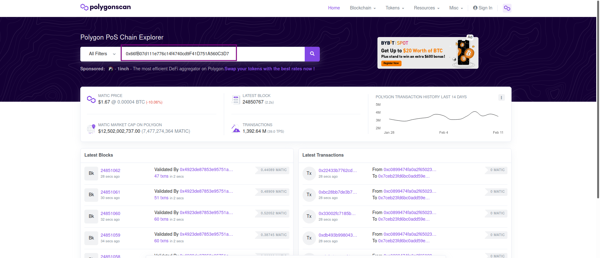

# Missão 3

Estamos evoluindo. Nas últimas duas missões nós configuramos nossa carteira na Metamask e incluímos a rede Polygon e o token Melk para visualização. A Metamask é apenas uma forma de visualizar uma parte do que está na blockchain. A Metamask é mais focada para gerenciar o seu saldo em cada token.

Existem outras formas de visualizar a sua carteira e as transações que aconteceram na blockchain, que são os sites de scan. E nessa missão vamos aprender a utilizá-los.


Atenção, não confunda `scan` com `scam`! Scan com N significa examinar, sondar, explorar. Scam com M significa golpe. Não vamos mexer com nada de golpe aqui não tá!? :innocent:


Só pra recapitular, ao confirmar a missão 1, você recebeu 1 ponto alguma coisa de MELK e na missão 2 você recebeu 5 MELK. Foram duas transações realizadas para recompensar o seu bom desempenho.

Vamos então aprender a ver essas transações.

Cada blockchain tem um ou mais sites que podem ser usados para visualizar as transações, mas cada um tem um site "oficial" que é mais usado pela maioria das pessoas.

No caso do Ethereum, o site mais famoso é o Etherscan que pode ser acessado pelo endereço [https://etherscan.io/](https://etherscan.io)

Existe também o [https://ethplorer.io/](https://ethplorer.io), o [https://ethblockexplorer.org/](https://ethblockexplorer.org) e o [https://explorer.bitquery.io/ethereum](https://explorer.bitquery.io/ethereum). Fique à vontade para explorá-los depois só por curiosidade. A diferença entre eles é a forma que mostram as informações, as facilidades de salvar os endereços e monitoramento com envio de notificação por e-mail para determinadas transações.

Como estamos usando a rede Polygon vamos usar o Polygon Scan para o nosso exercício.

### 1. Acesse o site do Polygonscan

Abra o seu navegador e acesse o endereço [https://polygonscan.com/](https://polygonscan.com)

Você verá uma página conforme a imagem abaixo.

.png>)

### 2. Copie e cole o seu endereço no campo de busca.

Você se lembra da missão 1, em que copiamos o nosso endereço público (similar a uma chave PIX, número da conta do banco) da Metamask? Para esta missão, vamos ter que copiar novamente.

Abra a extensão do Metamask, na parte superior direita do seu navegador. Depois copie o seu endereço público como mostrado na imagem:

 (1).png>)

Depois de copiar o endereço, cole no campo de busca do Polygon Scan e clique no ícone de pesquisa.

O resultado deve ser parecido com esse. Vamos encontrar nossas transações!

 (1).png>)

### 3. Encontrando as transações

Vamos confirmar que estamos na mesma tela. Ela deve se parecer com isso:

Vamos entender um pouco mais sobre essa parte destacada em roxo e encontrar as transações das recompensas das outras missões.

Note que a seção _Transactions_ está selecionada, e mesmo assim, as nossas transações não estão aparecendo. Isso acontece porque essa seção apresenta transações no token padrão da rede Polygon, o MATIC, mencionado anteriormente. Para encontrar o nosso token MELK, precisamos ir para a seção _ERC-20 Token Txns_. Como mencionado antes, o token MELK se encaixa na categoria ERC-20, construído em cima da rede Polygon. Vamos clicar na seção de tokens ERC-20:

Aí está! Agora estamos visualizando as transações de recompensa do nosso token MELK! Mas antes de receber a nossa recompensa, vamos falar um pouco sobre transações.

### 4. Entendendo as transações

Explicando de maneira simples, quando uma transação é requisitada e autenticada, ela é colocada em um bloco, que vai representar as transações que estão dentro dele. É importante entender que um bloco contém várias transações. No Ethereum, por exemplo, um bloco pode armazenar um número próximo a 70 transações. Depois, esse bloco é enviado para uma fila de espera chamada pool. Quando sair da file de espera, os nodes validadores da rede (que irão validar a transação e colocá-la na blockchain atual) validam a transação e recebem a recompensa por terem validado (um exemplo são os mineradores de Bitcoin, que na verdade são validadores). Depois, o bloco é adicionado à blockchain existente, e essa atualização é distribuída por toda a rede. Após finalizar esse processo, a transação está completa.

Aqui está um resumo do processo:

.png>)

### 5. Manda no Discord o Txn Hash da primeira transação para receber a recompensa dessa missão

Parabéns por chegar até aqui! Vá até o [canal da missão 3 do experimento Melk no Discord](https://discord.com/invite/uDyHmwBw6E) e mande uma mensagem com o hash da transação com o valor de 1 MELK token que vimos no site do Polygon Scan. No meu caso, mandaria esse valor:

.png>)

Para copiá-lo por completo, clique em cima dele. Isso te levará até outra página, como essa, que veremos nas próximas aulas:

 (1).png>)

A partir daí, só copie no botão sinalizado acima e mande no [Discord!](https://discord.com/invite/uDyHmwBw6E)

Qualquer dúvida, sinta-se livre para mandar mensagens no canal de [bate papo no Discord](https://discord.com/channels/898706705779687435/932249635496525834).


Nesta missão tivemos 2 aprendizados: Aprendemos como as transações funcionam e aprendemos a visualizar as nossas transações utilizando o site de Scan da rede Polygon.

